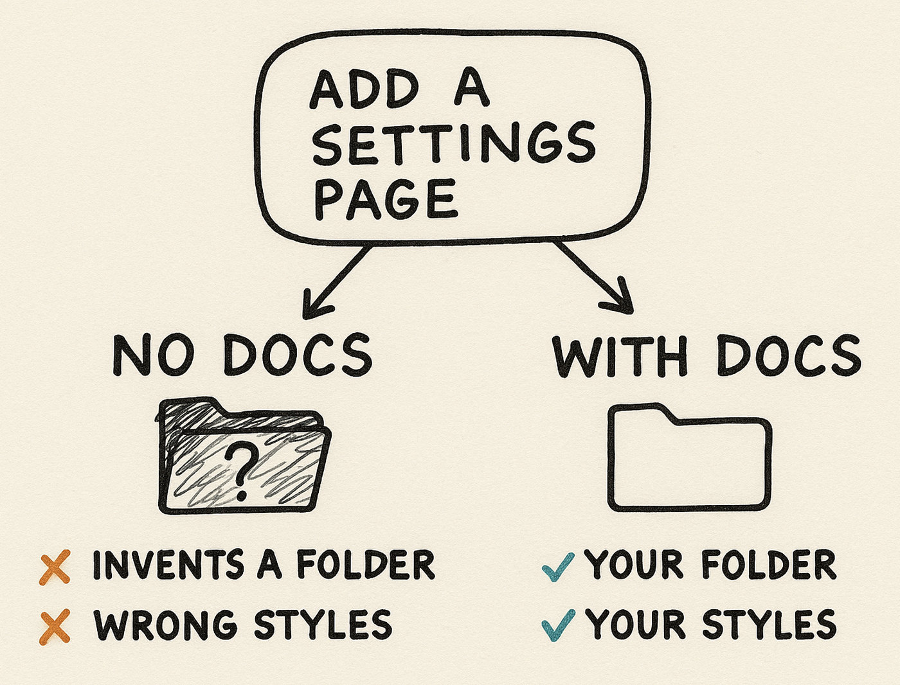
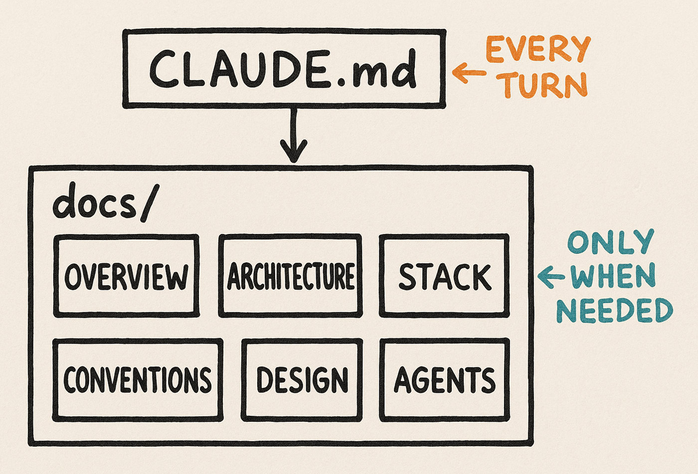

<h1 align="center">Agentic Engineering</h1>

<p align="center">
  <b>Your coding agent starts every session from zero.</b><br>
  This gives it a memory of your project: a small <code>docs/</code> layer that one paste writes from your real code, in about fifteen minutes.
</p>

<p align="center">
  The kit is one layer of the method I teach in <b>Prompt to Production</b>.
  <a href="https://europe-west1-rag-techniques-views-tracker.cloudfunctions.net/rag-techniques-tracker?notebook=agentic-engineering--readme&click=course-free-module-top&target=https%3A%2F%2Fwww.diamant-ai.com%2Fcourses%3Futm_source%3Dgithub%26utm_medium%3Dreadme%26utm_campaign%3Dagentic-engineering-top&retarget=0&text=course-free-module-top"><b>One full module is free.</b></a>
</p>

<p align="center">
  <a href="https://www.apache.org/licenses/LICENSE-2.0"></a>
  <a href="https://github.com/NirDiamant/Agentic_Engineering/stargazers"></a>
  <a href="https://github.com/NirDiamant/Agentic_Engineering/issues"></a>
</p>

> ⭐  **If you find this useful, please star the repo** so more developers can find it.

---

Your agent can read your code. It can't read the decisions behind it. Where does a new file go here? Why this database and not the obvious one? None of that is in the repo, so the agent guesses with whatever was most common in its training data.



So you write those decisions down where the agent will read them. By hand that's an afternoon per repo. This does it from your real code instead.

> **Not a [Spec Kit](https://github.com/github/spec-kit) replacement.** Spec Kit writes a spec, then builds the code from it. This reads the code you already have and writes the memory your agent is missing. Use both.

## Run it

Paste this to the agent already working in your repo:

```
Clone https://github.com/NirDiamant/Agentic_Engineering into a temp folder, read its RUN.md, and follow it on this repository.
```

What it promises you:

- It writes `docs/`, one instruction file at your repo root (plus a one-line pointer if your tools need the other name), a scorecard beside it, and the kit's two commands into `.claude/commands/`. Nothing else changes.
- It deletes nothing of yours and overwrites nothing of yours. Your files are read as input. The most it does to one is append a dated entry to a log that is already append-only.
- It stops once, for your approval, before it writes the layer. The only thing on disk before that is your scorecard.
- About fifteen minutes.

## The check

Before it reads your code it answers five questions about your repo, cold. After the docs exist, it answers the same five again reading only what this run wrote, and prints the score, plus a count of the claims in your own docs that your code contradicts:

```
AGENT MEMORY CHECK: seo-autopilot
Before the docs layer:  3 of 5 questions right
After:                  5 of 5
It was guessing about:  which tools are installed vs only planned; the conventions the linter actually enforces; that packages/db is wired to nothing
Contradictions found in your existing docs: 5
Written:                CLAUDE.md + 4 docs, 4 unconfirmed
Still advisory: nothing enforces these rules. That takes hooks, tests, CI.
```

A real run on a real repo, not a mock-up. It went 3 to 5, and the interesting half is the 3. That repo has a good README and a
600-line spec, so the agent had plenty to read. It read all of it and still named two
tools that are installed nowhere in the tree, because they sit in the spec as a plan.
It reported the plan as the stack, with the label SURE on it.

The contradictions line is the five claims in that repo's own README and spec that its
code disproves: two tools named in the spec that no package installs, a scheduler the
spec never chose doing the work, an upload the docs call unbuilt that shipped. Zero is
a normal answer on a repo whose docs are current.

## What goes into your repo



Each file answers one question your code can't. Here is `TECH_STACK.md`, filled in:

```markdown
- **Database:** PostgreSQL
- **Why Postgres:** the team already knows it, and we don't need anything fancier.
```

The second line is the one that matters. Your code already shows that you use Postgres. Why you chose it lives in someone's head, and an agent that never heard the reason will swap it for whatever it saw more often in training.

## Keeping it alive

When the agent gets something wrong: *"update CLAUDE.md so you don't repeat that, and tell me which old rule can come out."*

When you stop for the day: *"update docs/context/CONTINUE_PROMPT.md with where we are and what's next."*

## No code yet?

[`/start-project`](skills/start-project/SKILL.md) builds the same layer for a stack you've already chosen, plus `SETUP.md`, `DEPLOYMENT.md`, `CI_CD.md` and `TESTING.md`. [`/spark`](skills/spark/SKILL.md) is for when it's still an idea: experimental, and it needs two skills that don't ship here, `/harness-plan` and `/harness-unleash`. Both are skills, so they need [one extra step](skills/README.md) to install. The reasoning under all of it is in [`docs/why_this_works.md`](docs/why_this_works.md).

## What this doesn't do

Your agent reads these files and tries to follow them. Nothing forces it. A rule that has to hold every single time belongs in a hook, a test, or a CI gate, and none of that ships here. Those layers are where the full method lives.

The final check is one model checking another. It catches empty placeholders and docs that contradict the code. It can't tell you the docs are true.

---

<h2 align="center">🎓 From a docs layer to production</h2>

<div align="center">

**Prompt to Production** is my course on building software with AI the way professionals do: the methods and paradigms behind reliable, efficient, modular production systems, taught systematically. Every module pairs a video lecture with a hands-on lab, from your first structured prompt to a working production system. The hooks, tests and CI gates this kit leaves out are in there.

### 🎁 Try a full module, free

<table>
<tr>
<td align="center">🎬<br><b>Video<br>lecture</b></td>
<td align="center">🛠️<br><b>Hands-on<br>lab</b></td>
<td align="center">✅<br><b>Acceptance<br>criteria</b></td>
</tr>
</table>

<a href="https://europe-west1-rag-techniques-views-tracker.cloudfunctions.net/rag-techniques-tracker?notebook=agentic-engineering--readme&click=course-free-module-cta&target=https%3A%2F%2Fwww.diamant-ai.com%2Fcourses%3Futm_source%3Dgithub%26utm_medium%3Dreadme%26utm_campaign%3Dagentic-engineering&retarget=0&text=course-free-module-cta"></a>

</div>

## 📫 Stay Updated

<div align="center">
<table>
<tr>
<td align="center">🚀<br><b>Weekly<br>Updates</b></td>
<td align="center">💡<br><b>Expert<br>Insights</b></td>
<td align="center">🎯<br><b>Top 0.1%<br>Content</b></td>
</tr>
</table>

<a href="https://europe-west1-rag-techniques-views-tracker.cloudfunctions.net/rag-techniques-tracker?notebook=agentic-engineering--readme&click=newsletter-subscribe-button&target=https%3A%2F%2Fnewsletter.diamant-ai.com%2F%3Fr%3D336pe4%26utm_campaign%3Dpub-share-checklist&retarget=0&text=Subscribe%20to%20DiamantAI%20Newsletter"></a>

*Join 40,000+ readers getting clear AI tutorials every week.*
</div>

---

**Contributing.** Sharpen `/apply` or tighten a template. [Issues](https://github.com/NirDiamant/Agentic_Engineering/issues) and PRs are welcome. Apache 2.0, see [LICENSE](LICENSE), and copy the output into any project, commercial ones included. These are starting points and not guarantees. They don't replace tests, review, or judgment.

<p align="center">
More open-source guides:
<a href="https://europe-west1-rag-techniques-views-tracker.cloudfunctions.net/rag-techniques-tracker?notebook=agentic-engineering--readme&click=related-rag-techniques&target=https%3A%2F%2Fgithub.com%2FNirDiamant%2FRAG_Techniques&retarget=0&text=related-rag-techniques">RAG</a> ·
<a href="https://europe-west1-rag-techniques-views-tracker.cloudfunctions.net/rag-techniques-tracker?notebook=agentic-engineering--readme&click=related-genai-agents&target=https%3A%2F%2Fgithub.com%2FNirDiamant%2FGenAI_Agents&retarget=0&text=related-genai-agents">Agents</a> ·
<a href="https://europe-west1-rag-techniques-views-tracker.cloudfunctions.net/rag-techniques-tracker?notebook=agentic-engineering--readme&click=related-prompt-engineering&target=https%3A%2F%2Fgithub.com%2FNirDiamant%2FPrompt_Engineering&retarget=0&text=related-prompt-engineering">Prompting</a> ·
<a href="https://europe-west1-rag-techniques-views-tracker.cloudfunctions.net/rag-techniques-tracker?notebook=agentic-engineering--readme&click=related-agent-memory-techniques&target=https%3A%2F%2Fgithub.com%2FNirDiamant%2FAgent_Memory_Techniques&retarget=0&text=related-agent-memory-techniques">Agent memory</a>
</p>

<p align="center"><sub>If this saved you a session of re-explaining your project, a star helps other people find it.</sub></p>


